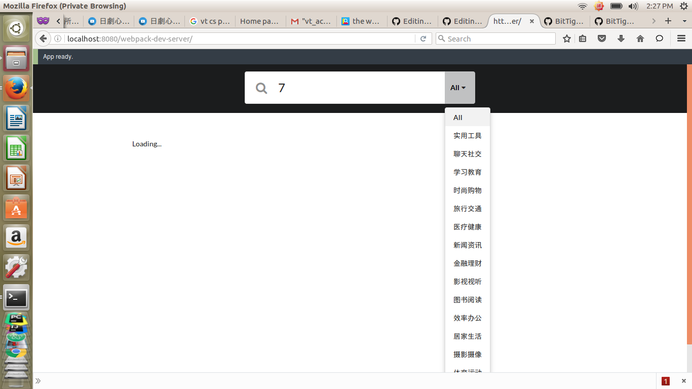

## Description
  - Built an app crawling "http://app.xiaomi.com" with Scapy and search system that finds interesting information based on MongoDB and ElasticSearch. 
  - Save data into MongoDB and connected MongoDB to ElasticSearch 
  - Integrated an interactive search system by NodeJs, Express and React 

## Demo
  - ScreenShot
    
    
    
  - GIF
  - Link
  - ...

## Usage
- Install lastest verison of ReactJS, Node.JS, ElasticSearch, MongoDB and mongo-connector
- npm install  
- Run elasticsearch and MongoDB
- Come to the root directory
  - node server
  - npm run dev
- Open a browser and input http://localhost:8080/webpack-dev-server/

## Components/Structure

### Crawler

```
  xiaomiapp
  |__ xiaomiapp
         |__ spiders
               |__ init__.py
               |__ xiaomi_spider.py
         |__ init__.py
         |__ items.py
         |__ pipelines.py
         |__ settings.py
```

  - xiaomi_spider.py defines how to crawl the webpage "http://app.xiaomi.com" by Scrapy.  
  - items.py defines the data fields which stored in MongoDB, ElasticSearch and Solr, even though in the project only the code    about MongoDB is used.  
  - pipelines.py defines the store process in MongoDB, ElasticSearch and Solr, even though in the project only the code about     MongoDB is used.  

  Run scrapy crawl xiaomi.
  
### Search System
Built a website to implement searching. Node.JS for back-end and React.JS for front-end, while Express.Js is used as a standard server framework for Node.js.

#### Back-End

```
services
 |__ basicService.js
 |__ esService.js

```
  - basicService implements the basic search function by Elasticsearch, which is used for test.
  - esService implements the advanced search function by ElasticSearch, which is used in the project.

#### Server Framework

```
routes
 |__ route.js
 
server.js

```
  - routes.js rewrites necessary API.
  - server.js defines http://localhost:3000 as back-end server.

#### Front-End

```
scripts
 |__ components
         |__ App.jsx
         |__ Container.js
         |__ Header.js
         |__ Items.js
         |__ Map.js
 |__ vendor
     |__ dropdown.js
     |__ transition.js
 |__ emitter.js
 |__ index.jsx
 
index.html
webpack-server.js
webpack.config.js

```
  - The scripts folder implements the interaction with back-end server and generates webpages by ReactJS.
  - webpack-server.js implements front-end server, following the configuration defined by webpack.config.js.


### Acknowledgement
### License
### Project Information
  - Category: full stack
  - Stack: ReactJS, Node.js, Express.js, MongoDB, ElasticSearch, Python

### Template
#### ReadMe Template
- [Github-Ranking-FrontEnd](https://github.com/hackjustu/Github-Ranking-FrontEnd)
- [Web-Crawle-rApp](https://github.com/nirvanastar/webcrawlerapp)

## Other Resource
- [Markdown Cheatsheet](https://github.com/adam-p/markdown-here/wiki/Markdown-Cheatsheet#headers)
- [Resource Summary](./Resource.md)

## Reference (continue adding)
- [LeoAJ/react-iTunes-search](https://github.com/LeoAJ/react-iTunes-search)
